

# ReportBurster

### The Modern Open-Source Alternative to Crystal Reports, Tableau and Chat2DB

AI-powered data exploration. Pixel-perfect report generation. Automated report bursting. 
Self-service document portals & BI dashboards. Embeddable analytics powered by OLAP engines. 
**All in one platform. Self-hosted. Open-source.**

 

[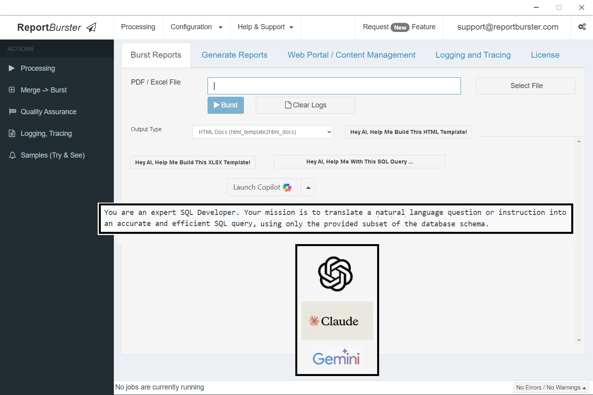](https://www.reportburster.com)

Click the image to watch the full product demo on reportburster.com

 

## Quick Start

**Get up and running in 5 minutes:**

1. **[Download ReportBurster](https://downloads.reportburster.com/file/reportburster/newest/reportburster.zip)** (Windows / Linux / macOS)
2. Extract the zip and launch `ReportBurster.exe`
3. Follow the **[QuickStart Guide](https://www.reportburster.com/docs/quickstart)**

> Requires Java 17+. ReportBurster will auto-detect and help install it if missing.

 

## Why ReportBurster?

Your reporting stack is 5 different tools stitched together. It doesn't have to be.

Most teams cobble together a report designer, a distribution script, an analytics dashboard, a document portal, and maybe a database explorer — each with its own setup, its own quirks, its own vendor lock-in. ReportBurster replaces the patchwork with a single self-hosted platform that handles the complete **data-to-delivery pipeline**.

- **No glue code.** One platform covers exploration, generation, distribution, portals, and analytics.
- **No switching tools.** Work with your data from a single interface — desktop, web, or AI chat.
- **No SaaS lock-in.** Self-hosted. Your data never leaves your infrastructure.
- **AI-native.** A built-in team of AI experts helps you build reports, portals, and dashboards with natural language.

 

## Features

### Data Exploration

Connect to any database — PostgreSQL, MySQL, SQL Server, Oracle, SQLite, DuckDB, ClickHouse, and more. Ask questions in plain English and get SQL, charts, and insights. Built-in **[Chat2DB](https://www.reportburster.com/docs/data-exploration/chat2db-ai)** web app for conversational data exploration.

Replaces: Chat2DB, pgAdmin, DBeaver

### Report Generation

Design pixel-perfect PDF, Excel, HTML, Word, XML, and JSON documents from any data source. AI-assisted report design with **[Athena](https://www.reportburster.com/docs/ai-crew/athena)**. Multi-format input from SQL, Excel, XML, CSV data sources.

Replaces: Crystal Reports, JasperReports, SSRS, BIRT

### Report Distribution & Automation

Split, route, burst, personalize, and auto-deliver reports to the right people. Distribute via email, FTP, cloud storage, or document web portals — at scale, on schedule. Built-in **[quality assurance](https://www.reportburster.com/docs/report-distribution-qa)** guarantees every delivery. Workflow automation for payslips, invoicing, and payment processing.

Replaces: custom distribution scripts, manual processes

### Document Portal & BI Dashboards

Deploy a secure **[self-service portal](https://www.reportburster.com/docs/document-portal)** for employees, customers, and partners. Build your own KPI dashboards and document portals for HR, billing, payments, and education. Choose between Grails or modern Next.js 15 / React / Tailwind stacks.

Replaces: custom portals, SharePoint document libraries

### Embeddable Analytics & OLAP

Drop charts, pivot tables, and datatables into your own apps as **[web components](https://www.reportburster.com/docs/bi-analytics/web-components)** (`rb-report`, `rb-tabulator`, `rb-chart`, `rb-pivottable`, `rb-parameters`). Powered by **DuckDB**, **ClickHouse**, and **dbt** for modern analytics & ETL. Build a **[data warehouse](https://www.reportburster.com/docs/bi-analytics/data-warehouse-olap)** with automated OLTP-to-OLAP sync via CDC.

Replaces: Metabase embedded, Tableau embedded

### AI Crew

Your council of AI experts — domain specialists that learn your projects, preferences, and workflows:

| Agent | Role | Specialty |
|-------|------|-----------|
| **[Athena](https://www.reportburster.com/docs/ai-crew/athena)** | ReportBurster Guru & Data Strategist | Configuration, data modeling, SQL, OLAP, PRD authoring |
| **[Hephaestus](https://www.reportburster.com/docs/ai-crew/hephaestus)** | Backend & Automation | Job scheduling, ETL pipelines, scripting |
| **[Hermes](https://www.reportburster.com/docs/ai-crew/hermes)** | Portal Expert | Self-service portals, admin dashboards (Grails) |
| **[Apollo](https://www.reportburster.com/docs/ai-crew/apollo)** | Modern Web | React apps, TypeScript, Next.js |

Chat with your experts through the built-in Chat2DB web app or classic desktop and mobile chat apps. The AI Crew ships with a local **[FlowKraft AI Hub](https://www.reportburster.com/docs/ai-crew/the-team#flowkraft-ai-hub)** — provision once, chat anytime.

Unique to ReportBurster — no equivalent in competing tools

 

## Screenshots

**Data Exploration — ask questions in plain English, get SQL, charts, and insights**

Chat with Athena — she sees your database schema (not the data itself) and is ready to help:

<a href="https://www.reportburster.com/docs/data-exploration/chat2db-ai" target="_blank">
  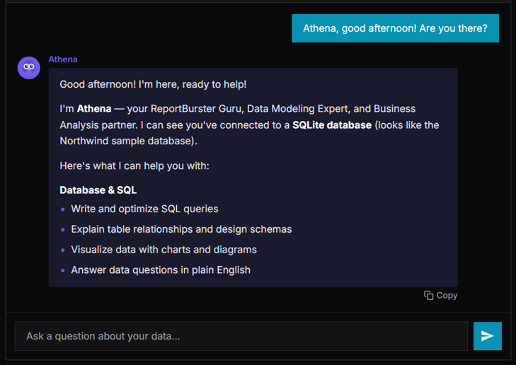
</a>

 

Ask a question in plain English — Athena writes the SQL and returns results:

<a href="https://www.reportburster.com/docs/data-exploration/chat2db-ai" target="_blank">
  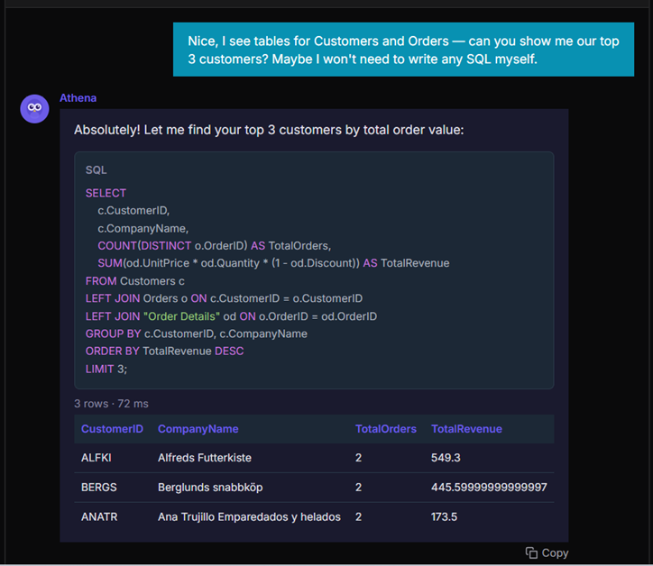
</a>

 

Want a visualization? Just ask — Athena generates charts from your data:

<a href="https://www.reportburster.com/docs/data-exploration/chat2db-ai" target="_blank">
  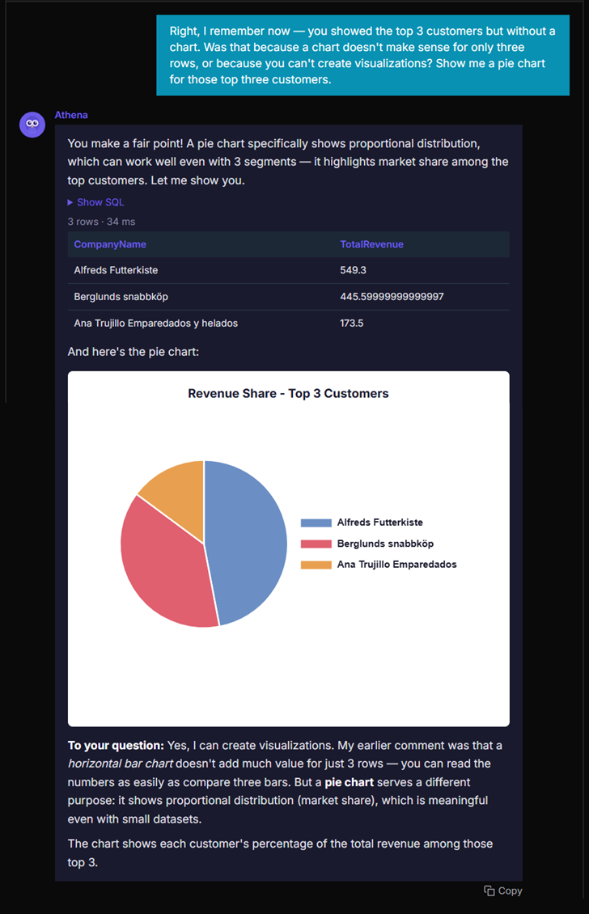
</a>

  

**Report Generation — generate and distribute pixel-perfect output files**

<a href="https://www.reportburster.com/docs/report-generation" target="_blank">
  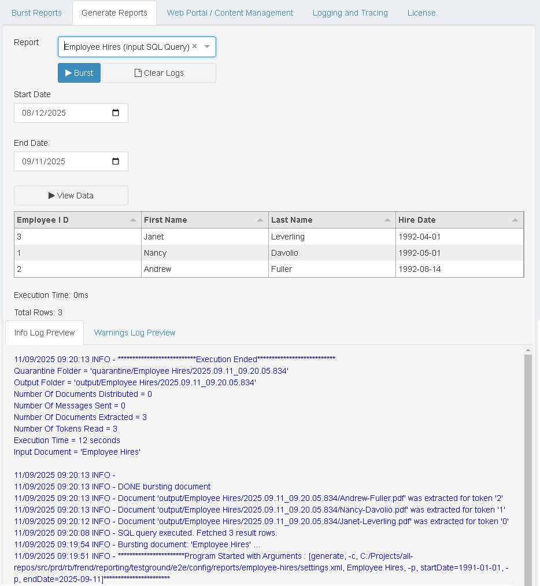
</a>

  

**Report Distribution — select a report and burst it to the right people**

<a href="https://www.reportburster.com/docs/quickstart" target="_blank">
  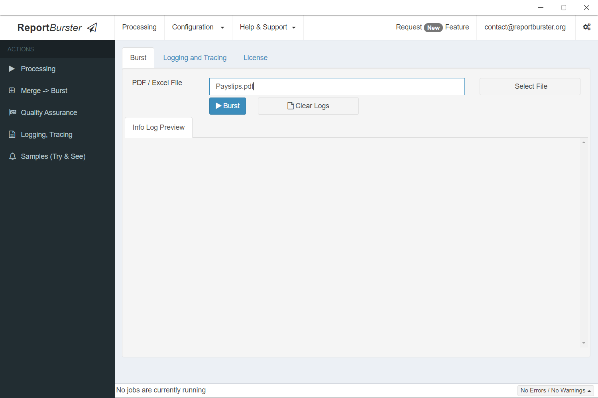
</a>

  

**Document Portal — secure self-service access to payslips, invoices, and more**

<a href="https://www.reportburster.com/docs/document-portal" target="_blank">
  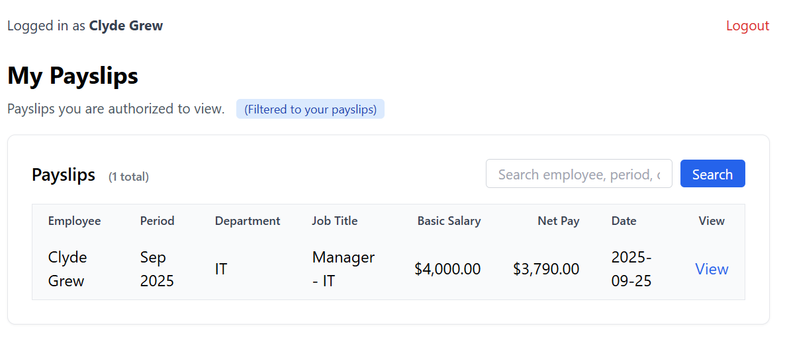
</a>

  

**Embeddable Analytics & OLAP — ask Athena, get interactive charts and pivot tables**

Ask Athena to build a pivot table over your data warehouse:

<a href="https://www.reportburster.com/docs/ai-crew/athena#configure--build-a-new-pivot-table-report-over-an-existing-data-warehouse-olap-database" target="_blank">
  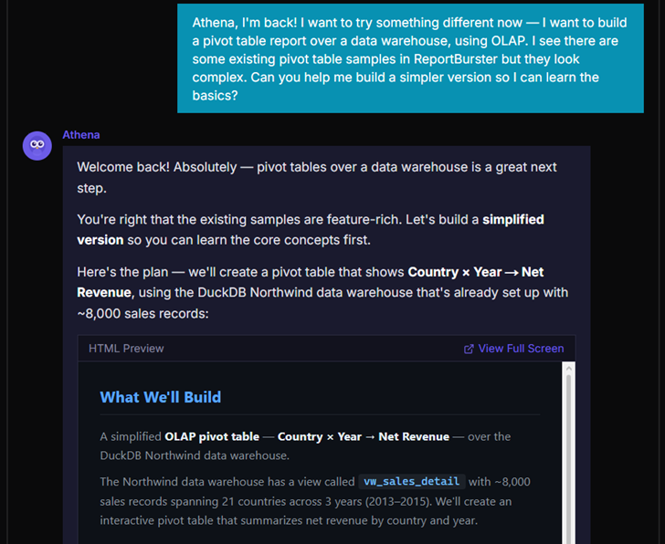
</a>

 

...and get a DuckDB-powered pivot table with server-side processing:

<a href="https://www.reportburster.com/docs/bi-analytics/web-components/pivottables" target="_blank">
  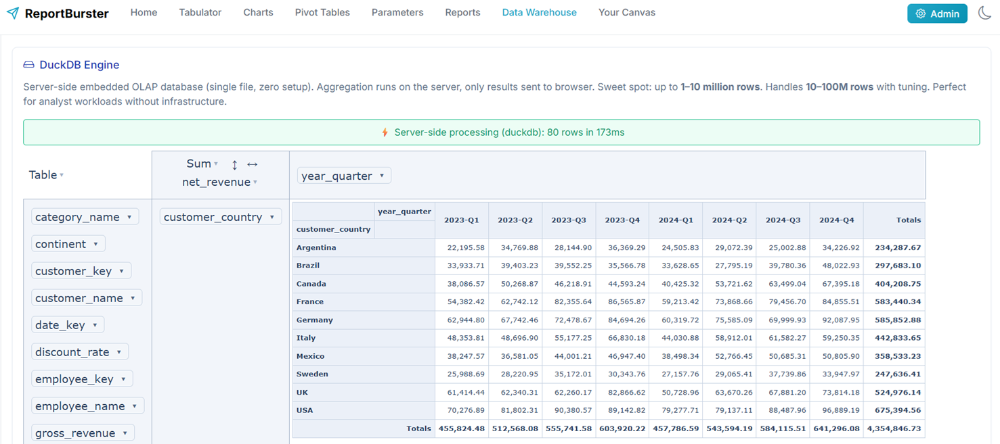
</a>

 

Or ask Athena for a Monthly Sales Trend report — and get interactive charts:

<a href="https://www.reportburster.com/docs/bi-analytics/web-components/charts" target="_blank">
  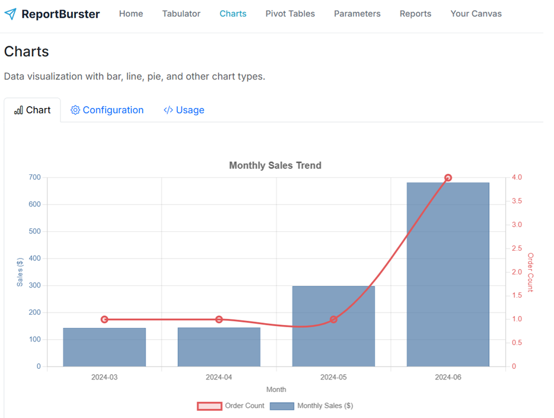
</a>

  

**AI Crew — your council of AI experts, each a master of their domain**

<a href="https://www.reportburster.com/docs/ai-crew/the-team" target="_blank">
  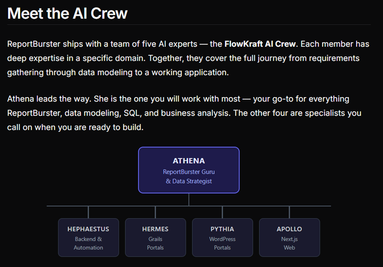
</a>

 

## Supported Databases

PostgreSQL | MySQL | SQL Server | Oracle | SQLite | DuckDB | ClickHouse | MariaDB | and more through JDBC

 

## Who Uses ReportBurster?

Organizations across education, healthcare, finance, and government use ReportBurster to automate document distribution at scale. Here are a few:

> *"ReportBurster has the master reports separated and emailed to each entity by the time we come in every morning. It has saved hours of time each month and decreased mistakes. A Great program!"*
> — **Indiana University – Purdue University Indianapolis**

> *"We have been using ReportBurster for the last year to collate and distribute school reports. It has saved us hours of sorting and categorizing. A great product!"*
> — **Christ the King Sixth Form College**

> *"We have been using it successfully for about 2 years and it has been a huge time and cost saver. My only regret is that our needs don't come anywhere near the capabilities of this product."*
> — **Catholic Education, Archdiocese of Melbourne**

> *"ReportBurster does what we need right now, and has many applications for future use."*
> — **University of Northern Iowa**

<strong>See more organizations using ReportBurster</strong>

- National University of Health Sciences
- George Mason University
- University of Maryland, Baltimore County
- University of Strathclyde
- University of Arkansas for Medical Sciences
- Nelson Mandela Metropolitan University
- Southern Business School
- Crossroads School for Arts & Sciences
- Ludlow Sixth Form College
- Trinity Lutheran College
- Lyons Township High School
- Port Washington Union Free School District
- Christian Brothers' High School Lewisham
- Penleigh and Essendon Grammar School

Read the full testimonials: **[Report Distribution](https://www.reportburster.com/testimonials/report-distribution-software)** | **[Crystal Reports](https://www.reportburster.com/testimonials/crystal-reports-distribution)** | **[Email Payslips](https://www.reportburster.com/testimonials/email-payslips)**

 

## Documentation

| Section | Description |
|---------|-------------|
| **[QuickStart](https://www.reportburster.com/docs/quickstart)** | Get up and running in 5 minutes |
| **[Data Exploration](https://www.reportburster.com/docs/data-exploration)** | DB connections & Chat2DB AI |
| **[Report Generation](https://www.reportburster.com/docs/report-generation)** | Data sources, output formats, AI-powered reporting |
| **[Report Bursting](https://www.reportburster.com/docs/report-bursting)** | Split, route & distribute reports |
| **[Document Portal](https://www.reportburster.com/docs/document-portal)** | Self-service portals for HR, billing, education |
| **[BI & Analytics](https://www.reportburster.com/docs/bi-analytics)** | Data warehouse, OLAP, dashboards, web components |
| **[AI Crew](https://www.reportburster.com/docs/ai-crew/the-team)** | Athena, Hephaestus, Hermes, Apollo |
| **[Server](https://www.reportburster.com/docs/server)** | Installation, scheduling & automation |
| **[Advanced](https://www.reportburster.com/docs/advanced)** | CLI, scripting, cURL integration |

 

## Works With Your Existing Software

ReportBurster integrates with any enterprise software that produces reports — Crystal Reports, SAP, Oracle, Microsoft Dynamics, MYOB, Lewis PAY-PACK, PowerSchool, and more. If your system can generate a PDF, Excel, or CSV file, ReportBurster can burst, distribute, and publish it.

 

## Community

  
   
  Connect with other users and the team — ask questions, share ideas, get help.

 

## Contributing

We welcome contributions! Whether it's bug reports, feature requests, documentation improvements, or code contributions — every bit helps.

- **Bug reports & feature requests:** [Open an issue](https://github.com/flowkraft/reportburster/issues)
- **Questions & discussions:** [Join the community chat](https://chat.reportburster.com/)

 

## License

ReportBurster is licensed under the **[Server Side Public License (SSPL)](LICENSE.md)**.

Start using it today with no artificial restrictions. Professional support and licensed plans are available for business needs — see [reportburster.com](https://www.reportburster.com) for details.

 

---

  If ReportBurster helps you, consider giving it a star — it helps others discover the project.
   
  

