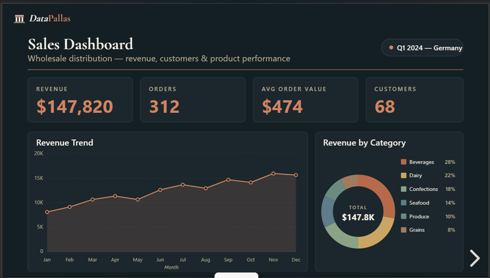
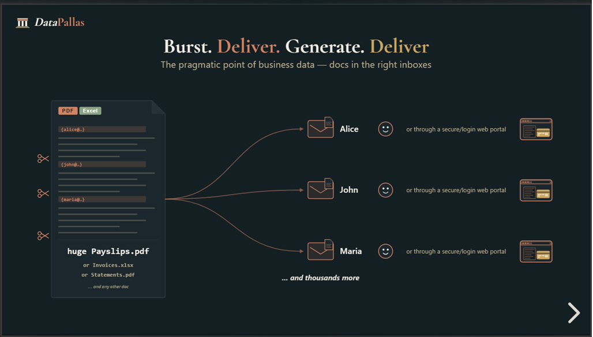
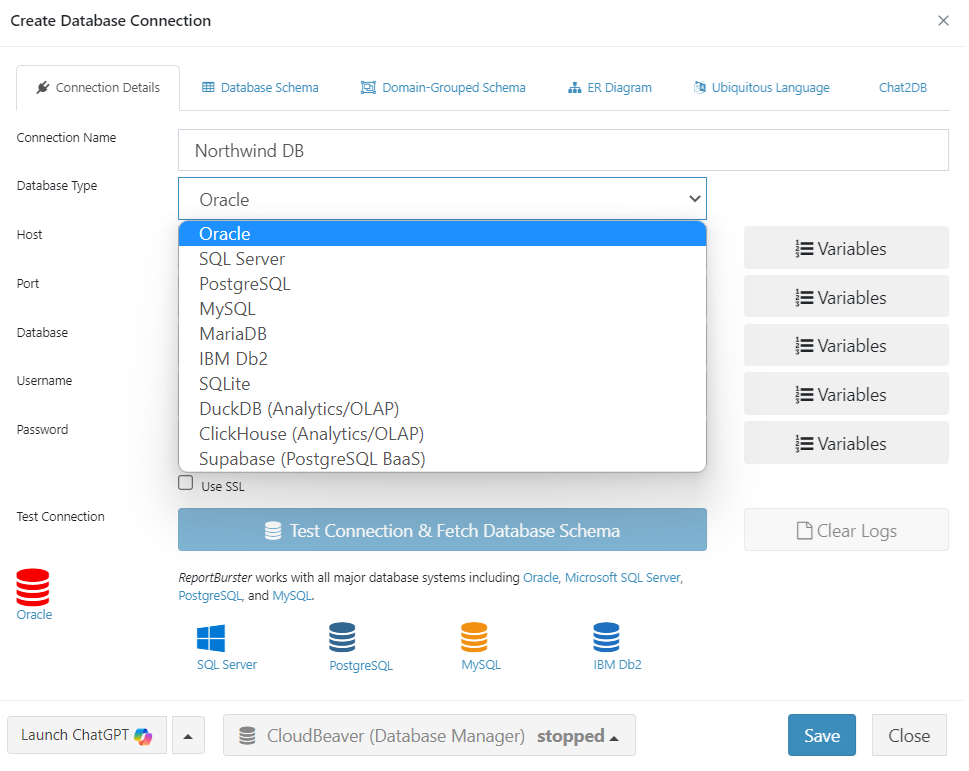

# DataPallas

*From **"I get it"** to **"it's live and beautiful"** — for any data requirement, faster than any other platform.*

### [Watch the video on datapallas.com &rarr;](https://datapallas.com)

 

## One Modern BI Platform, Not Three Legacy Ones

| What you need | What you're using today | DataPallas |
|---|---|---|
| **[1.&nbsp;Data Exploration](https://datapallas.com/docs/data-exploration)** | ~~Google Looker~~, ~~SQL Server Management Studio~~, ~~Toad~~, ~~manual SQL queries~~ | Chat2DB AI — ask in natural language, get SQL, results, and charts |
| **[2.&nbsp;Dashboards&nbsp;&amp;&nbsp;Analytics](https://datapallas.com/docs/bi-analytics/dashboards)** | ~~Tableau~~, ~~Power BI~~, ~~Metabase~~, ~~Superset~~ | Embeddable data-tables, charts, pivot tables, and analytics |
| **[3.&nbsp;Report Generation](https://datapallas.com/docs/report-generation)** | ~~Crystal Reports~~, ~~SSRS~~, ~~JasperReports~~ | Pixel-perfect PDFs, Excel, HTML, Word from any data source |

Also includes: [4. report bursting](https://datapallas.com/docs/report-bursting) | [5. self-service document portals](https://datapallas.com/docs/document-portal) | [6. AI crew](https://datapallas.com/docs/ai-crew/the-team)

 

 

## Self-Host with Docker (Windows, Linux, macOS)

1. Download **[datapallas-server-docker.zip](https://downloads.datapallas.com/file/datapallas/newest/datapallas-server-docker.zip)**
2. Extract the zip and navigate to the `ReportBurster` directory
3. Run `docker compose up -d`
4. Open `http://localhost:9090`

 

 

## Features

**[1. AI-Powered Data Exploration](https://datapallas.com/docs/data-exploration)**
- Connect to any database — PostgreSQL, MySQL, SQL Server, Oracle, SQLite, DuckDB, ClickHouse, and more
- Build interactive views on the [explore data canvas](https://datapallas.com/docs/data-exploration/canvas) — drag tables or cubes, configure widgets visually, apply shared filters
- Built-in [Chat2DB](https://datapallas.com/docs/data-exploration/chat2db-ai) web app — ask questions in natural language, get SQL, results, and visualizations instantly

**[2. Dashboards, Analytics & Semantic Layer](https://datapallas.com/docs/bi-analytics)**
- Define metrics, dimensions, and joins once in a [semantic layer (cubes)](https://datapallas.com/docs/semantic-layer) — every chart, pivot, and dashboard reads from the same source of truth
- Build interactive [dashboards](https://datapallas.com/docs/bi-analytics/dashboards) for sales, finance, and real-time business monitoring
- Embed [datatables](https://datapallas.com/docs/bi-analytics/web-components/datatables), [charts](https://datapallas.com/docs/bi-analytics/web-components/charts), and [pivot tables](https://datapallas.com/docs/bi-analytics/web-components/pivottables) as web components directly in your own apps
- Build a [data warehouse](https://datapallas.com/docs/bi-analytics/data-warehouse-olap) with OLTP-to-OLAP sync via CDC — powered by DuckDB, ClickHouse, and dbt

**[3. AI Crew](https://datapallas.com/docs/ai-crew/the-team)**
- Your council of AI domain experts: Athena (data & reports), Hephaestus (automation & ETL), Hermes (portals), Apollo (modern web)
- Agents learn your projects, preferences, and workflows — improving with every interaction
- Chat through the built-in Chat2DB web app or classic desktop and mobile chat apps

**[4. Report Bursting & Automation](https://datapallas.com/docs/report-bursting)**
- Split, personalize, and auto-deliver reports to the right people — via email, FTP, or cloud storage, at scale, on schedule
- Built-in [quality assurance](https://datapallas.com/docs/report-distribution-qa) guarantees every delivery
- Automate payslips, invoicing, and payment processing workflows

**[5. Report Generation](https://datapallas.com/docs/report-generation)**
- Design pixel-perfect PDFs, Excel, HTML, and Word documents from any data source
- Multi-format input: SQL, Excel, XML, CSV
- [Large-scale generation](https://datapallas.com/docs/report-generation/large-scale) — seed millions of records and benchmark on your hardware

**[6. Self-Service Document Portals](https://datapallas.com/docs/document-portal)**
- Build secure portals for employees, customers, and partners — HR, billing, payments, education
- Choose between Grails or modern Next.js 15/React/Tailwind stacks

## See Samples

**[See all samples](https://datapallas.com/docs/samples)** — report bursting, report generation, interactive dashboards, pivot tables, and more.

## Works With All Major Databases

## Documentation

Full documentation is available at **[datapallas.com/docs](https://datapallas.com/docs)**.

## Contributing

We welcome contributions! Bug reports, feature requests, documentation, or code — every bit helps.

- **Bug reports & feature requests:** [Open an issue](https://github.com/flowkraft/datapallas/issues)

## All Features Are Included

**Start using it today with no artificial restrictions — all features included. No community vs. enterprise editions.**

---

## Stay Up-to-Date

Watch this repository to be notified of future updates:

