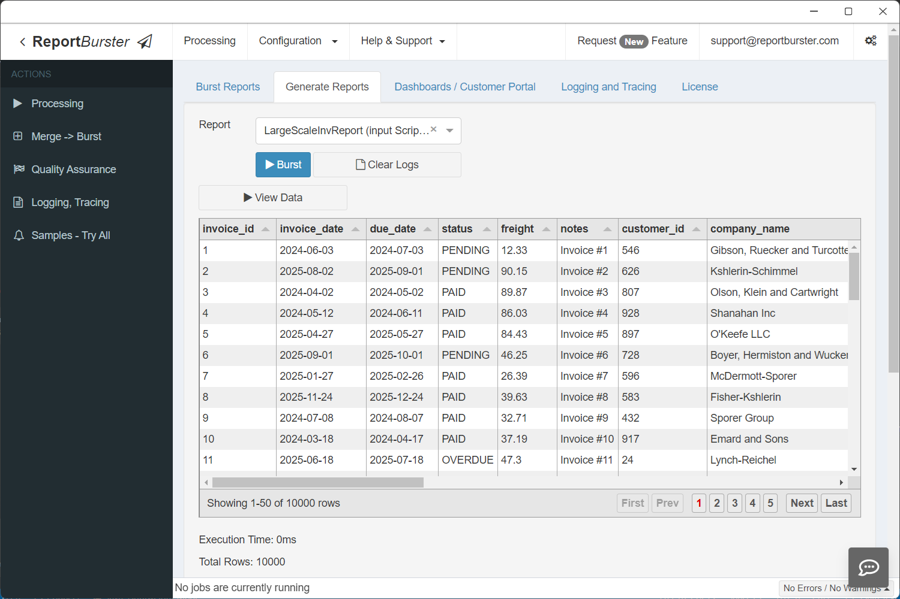
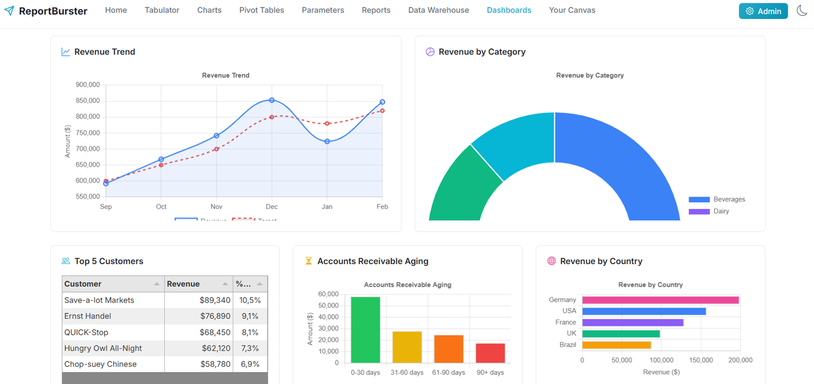

# ReportBurster - Business Intelligence For The New Era

## One Modern BI Platform

Your reporting and BI stack is 3 different tools stitched together. It doesn't have to be.

 

**One self-hosted BI platform for pixel-perfect reports, BI dashboards, and AI-powered data exploration.** No glue code. No SaaS lock-in. Your data stays on your own servers.

<h3><a href="https://www.reportburster.com" target="_blank">Watch the demo video on reportburster.com &rarr;</a></h3>

 

## One Modern BI Platform, Not Three Legacy Ones

| What you need | What you're using today | ReportBurster |
|---|---|---|
| **[Report generation](https://www.reportburster.com/docs/report-generation)** | Crystal Reports, SSRS, JasperReports | Pixel-perfect PDFs, Excel, HTML, Word from any data source |
| **[BI dashboards](https://www.reportburster.com/docs/bi-analytics/dashboards)** | Tableau, Power BI | Embeddable charts, pivot tables, and analytics |
| **[Data exploration](https://www.reportburster.com/docs/data-exploration)** | SQL Server Management Studio, Toad, manual SQL queries | Built-in Chat2DB web app — ask in natural language, get SQL, results, and visualizations |

Also includes: [report bursting](https://www.reportburster.com/docs/report-bursting) | [self-service document portals](https://www.reportburster.com/docs/document-portal) | [AI agents](https://www.reportburster.com/docs/ai-crew/the-team)

## See Samples

ReportBurster ships with many ready-to-run samples — report bursting, report generation, interactive dashboards, pivot tables, and more. **[See all samples](https://www.reportburster.com/docs/samples)**

## Stay Up-to-Date

Watch this repository to be notified of future updates:

## Quick Start

**Get up and running in 5 minutes:**

1. **[Download ReportBurster](https://downloads.reportburster.com/file/reportburster/newest/reportburster.zip)** (Windows / Linux / macOS)
2. Extract the zip and launch `ReportBurster.exe`
3. Follow the **[QuickStart Guide](https://www.reportburster.com/docs/quickstart)**

## Screenshots

### **Report Generation** — generate and distribute pixel-perfect output files

 

### **BI Dashboards** — embeddable charts, pivot tables, and analytics

 

### **Data Exploration** — ask a question in plain English, get SQL, results and charts

 

## Works With All Major Databases

## Contributing

We welcome contributions! Whether it's bug reports, feature requests, documentation improvements, or code contributions — every bit helps.

- **Bug reports & feature requests:** [Open an issue](https://github.com/flowkraft/reportburster/issues)

## All Features Are Included

**Start using it today with no artificial restrictions — all features are included. No community vs. enterprise editions.**

---

If ReportBurster helps you, consider giving it a star — it helps others discover the project.

