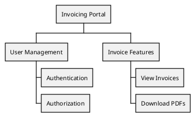

# Product Requirements Documents (PRDs)

This directory contains **shared product documentation** where the FlowKraft AI Crew collaborates on requirements and tasks.

## Purpose

The `/docs/product/` folder is the **central collaboration space** where:
- Athena writes Product Requirements Documents (PRDs)
- Implementation agents (Hephaestus, Hermes, Apollo) write task breakdowns
- PlantUML diagrams visualize feature hierarchies
- The team coordinates on project requirements

## Folder Structure

```
product/
├── <requirement-name>.org          # PRD document (Org Mode)
├── <requirement-name>-tasks.org    # Task breakdown (agent-specific)
└── diagrams/
    └── <requirement-name>.puml     # PlantUML WBS diagram
```

## Document Types

### 1. PRD Documents (`.org`)
**Author**: Athena
**Format**: Org Mode
**Purpose**: Define product vision, features, user stories, acceptance criteria

**Example**: `invoicing-portal.org`

```org
#+TITLE: Invoicing Portal - Product Requirements

* Vision
A self-service portal where customers can view and download their invoices.

* Features
** User Authentication
...
```

### 2. Task Breakdowns (`.org`)
**Author**: Implementation agents (Hephaestus, Hermes, Apollo)
**Format**: Org Mode
**Purpose**: Break down PRD into implementation tasks specific to their domain

**Example**: `invoicing-portal-tasks.org` (by Hermes)

```org
#+TITLE: Invoicing Portal - Grails Implementation Tasks

* DONE Setup Grails Project Structure
* TODO Create Invoice Domain Model
* TODO Build GSP Views
...
```

### 3. WBS Diagrams (`.puml`)
**Author**: Athena (or any agent)
**Format**: PlantUML Work Breakdown Structure
**Purpose**: Visualize feature hierarchies

**Example**: `diagrams/invoicing-portal.puml`



## Access Patterns

| Agent | Read Access | Write Access |
|-------|------------|--------------|
| Athena | ✅ All PRDs | ✅ Create PRDs, diagrams |
| Hephaestus | ✅ All PRDs | ✅ Create task breakdowns |
| Hermes | ✅ All PRDs | ✅ Create task breakdowns |
| Apollo | ✅ All PRDs | ✅ Create task breakdowns |

## Workflow

1. **Athena creates PRD**: `invoicing-portal.org`
2. **Athena creates WBS diagram**: `diagrams/invoicing-portal.puml`
3. **User chooses implementation agent** (Hermes for Grails, Apollo for Next.js, etc.)
4. **Implementation agent reads PRD** and creates task breakdown: `invoicing-portal-tasks.org`
5. **Team iterates** - PRD and tasks can be updated as project evolves

## Docker Mount

This folder is mounted in the Letta container as `/docs/`:

```yaml
volumes:
  - ${REPORTBURSTER_INSTALLATION_FOLDER}/_apps/flowkraft/_ai-crew/docs:/docs
```

Agents access PRDs at `/docs/product/*.org` inside the container.

## Separation from Agent Offices

| Aspect | Agent Offices (`/agents-hq/`) | Product Docs (`/docs/product/`) |
|--------|-------------------------------|--------------------------------|
| **Purpose** | Personal workspace | Shared collaboration |
| **Content** | Reference materials, notes | PRDs, tasks, diagrams |
| **Access** | Owner + Athena (read) | All agents (read/write) |
| **Lifecycle** | Persistent | Project-specific |

## PlantUML Resources

- **WBS Diagrams**: https://plantuml.com/wbs-diagram
- **Online Editor**: https://www.plantuml.com/plantuml/uml/
